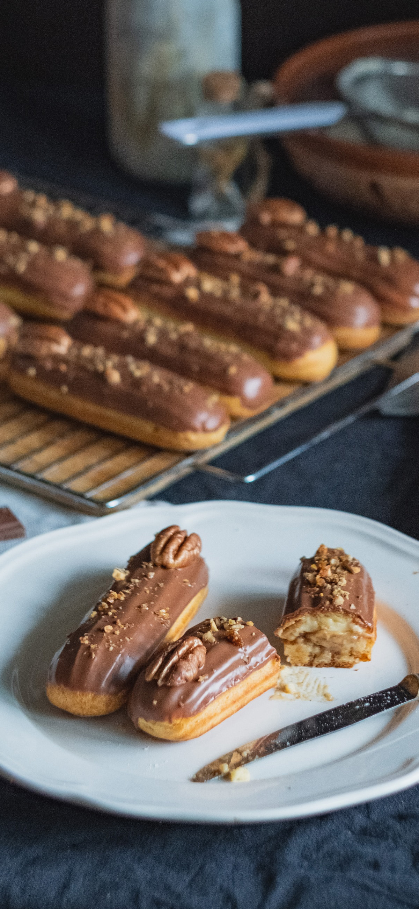
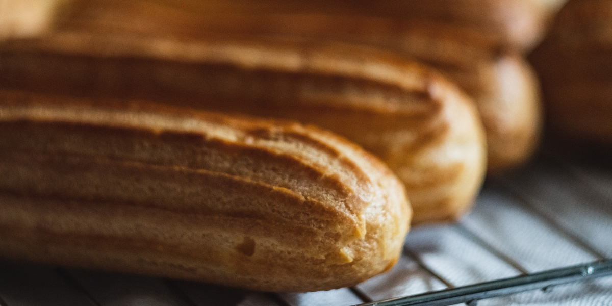
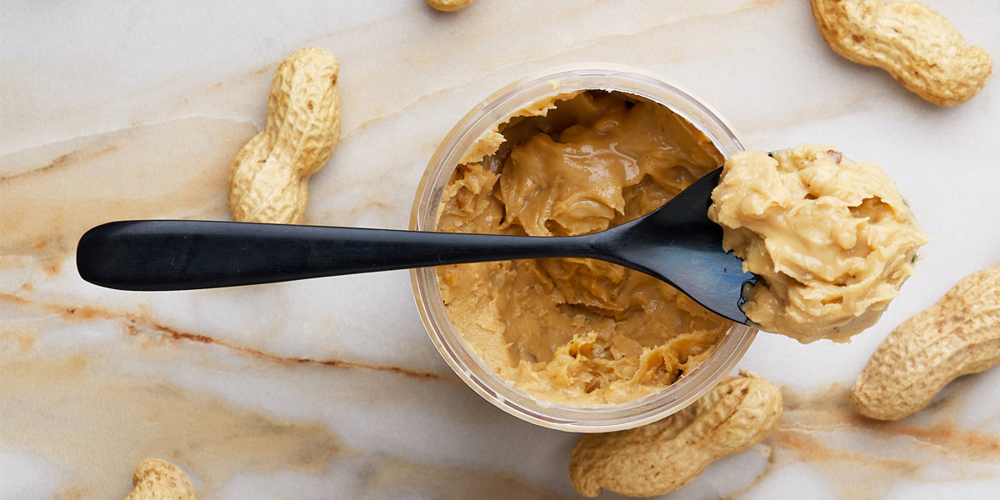
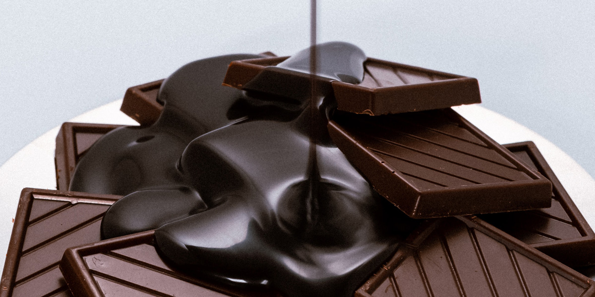

# BANDARRA SYDNEY HOMEWORK 3
## Welcome to My Respository: Homemade Chocolate Eclairs with Peanut Butter Mousse Filling
 **HW #3 – CSS CASCADE, SELECTION & PSEUDO SELECTORS**
MMED-1054 Homework 3 - To-Do-List

 This is a GitHub Repo for the Multi-Media Authouring MMED-1054 Homework #3 - CSS CASCADE, SELECTION & PSEUDO SELECTORS.

 ## Follow This 3 Part Recipe to Make Chocolate Eclairs with Peanut Butter Mousse Filling

### Part One: Choux Pastry (Pâte à Choux)

 

### Part Two: Peanut Butter Mousse

 

### Part Three: Chocolate Ganache

 

## Installation
No installation required
## Usage
Practice fair use. Start with the README.md file, then view [index.html](index.html)

**How to Use the Index Page:**
*Check the checkboxes for each step as you complete it to keep track of your baking progress.*
1. Make the Choux Pastry
2. Make the Peanut Butter Mousse
3. Make the Chocolate Ganache

### History
Version history is documented through GitHub best practices.
### Contributing
**Syd (Sydney) Bandarra** (they/them)

Student at Fanshawe College, Interactive Media Design, IDP, Fall 2023

Faculty of Creative Industries,

School of Digital and Performing Arts

137 Dundas Street, London, ON N6A 1E9

Student #: 1204224

s_bandarra@fanshaweonline.ca

www.fanshawec.ca 

### Land Acknowledgement 
London, Ontario is located on the traditional lands of the Anishinaabek, Haudenosaunee, Lūnaapéewak and Attawandaron peoples. This land continues to be home to diverse Indigenous peoples, whom we recognize as contemporary stewards of the land, vital contributors of our society, and deserving of sovereignty and reconciliation.

### Credits
**Images sourced from:** https://unsplash.com/
- Photo by Diliara Garifullina on Unsplash (choux_pastry.jpg)
https://unsplash.com/photos/brown-cookies-on-gray-textile-JKQeWF39NdA?utm_content=creditShareLink&utm_medium=referral&utm_source=unsplash

- Photo by Diliara Garifullina on Unsplash (chocolate_eclairs.jpg)
https://unsplash.com/photos/brown-bread-on-white-ceramic-plate-4EM7wIz-_8I?utm_content=creditShareLink&utm_medium=referral&utm_source=unsplash

- Photo by Kier in Sight Archives on Unsplash (chocolate_ganache.jpg)
https://unsplash.com/photos/black-and-brown-heart-shaped-decor-LjzAqkZnGFM?utm_content=creditShareLink&utm_medium=referral&utm_source=unsplash

- Photo by Corleto Peanut butter on Unsplash (peanut_butter_mousse.jpg)
https://unsplash.com/photos/peanut-butter-with-black-spoon-u256GzFi7Gw?utm_content=creditShareLink&utm_medium=referral&utm_source=unsplash

- (bakery_logo.jpg) https://masterbundles.com/gulrasheed63/bakery-logo-sweet-bakery-logo-bakery-editable-resizable-logo-design-ai-eps/

**Recipes Sourced From:**
- https://sallysbakingaddiction.com/homemade-eclairs/#tasty-recipes-66688
- https://sallysbakingaddiction.com/choux-pastry/

### License
MIT License
